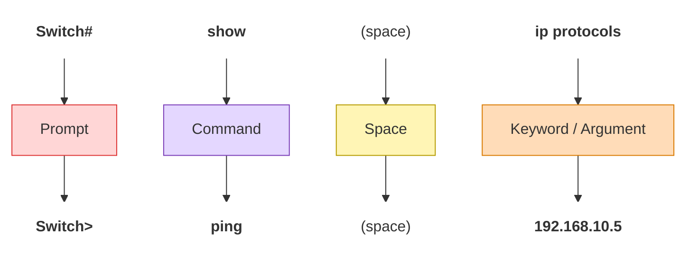

## 1. Các mode cơ bản trong CLI các thiết bị mạng
### 1. User mode (*1*)
**Cách chuyển**: Khi mới đăng nhập vào thiết bị

Kết thúc bằng dấu `>`
```bash
Switch>
```

Chỉ xem thực thi được 1 số câu lệnh cơ bản như `ping`, `tracert`, ...


### 2. Privilledge mode (*2*)
**Cách chuyển**: Khi từ `User mode` gõ từ khóa `enable`

Kết thúc bằng dấu `#`
```bash
Switch#
```

Thực thi toàn bộ tập lệnh của thiết bị, có thể xem thông tin chi tiết hơn của thiết bị

### 3. Global config mode (*3*)
**Cách chuyển**: Khi từ `Privilledge mode` gõ từ khóa `config terminal`

Kết thúc bằng dấu `(config)#`
```bash
Switch(config)#
```

Thực thi thêm được một số câu lệnh nâng cao hơn 1 chút, có thể xem thông tin chi tiết hơn của thiết bị\
Có thể sub-config mode

#### 3.1 Line configuration mode (*3.1*)
- Cho phép cấu hình các tham số liên quan đến `user/pass` của thiết bị, thời gian time out nhất định nếu không có tác động của Admin 

#### 3.2 Interface configuration mode (*3.2*)
Cấu hình chi tiết 1 interface (*có thể vật lý hoặc logic*)

## 2. Cấu trúc của 1 câu lệnh


**4 thành phần**:
- Prompt: tên thiết bị, mode thiết bị
- Command: câu lệnh/từ khóa được định nghĩa sẵn
- Space: phân cách
- Keyword / Argument: được định nghĩa sẵn

**Lệnh hỗ trợ**:
- **Context Sensitive**: Nếu quên 1 câu lệnh nào đó, có thể dùng `?` để có thể được gợi ý những lệnh hỗ trợ tiếp theo
- **Command Syntax Check**: Nếu lệnh gõ sai sẽ được mô tả bên dưới và có dấu `^` trỏ lên đúng chỗ sai
- **Tab**: khi gõ được 1 phần từ khóa, ta có thể sử dụng phím `TAB` để hoàn thành từ khóa tự động
- **Short cut**: nếu gõ được 1 phần của câu lệnh, mà từ khóa đó đã là duy nhất thì `IOS` tự động hiểu. VD: `config terminal` = `conf t`


## 3. Cấu hình cơ bản 1 thiết bị
- Đặt tên thiết bị:
```bash
hostname <tên thiết bị>
```

- Đặt tên **đăng nhập**:
```bash
username <tên đăng nhập>
```

- Đặt **tên đăng nhập** kèm **mật khẩu**:
```bash
username <tên đăng nhập> password <mật khẩu>
username <tên đăng nhập> secret <mật khẩu> ## Mã hóa mật khẩu 
```

VD: `user cisco password 123`

- Đặt **enable password** (*Giới hạn việc truy cập từ mode 1 sang mode 2*):
```bash
enable password <mật khẩu>
enable secret <mật khẩu> ## Mã hóa mật khẩu
```
- Dịch vụ mã hóa mật khẩu: mã hóa mật khẩu ngay cả khi không cần lệnh mã hóa lúc đặt như `secret`
```bash
service password-encryption
```

- Kiểm tra cấu hình mà thiết bị đang chạy:
```bash
show running-config
```
```bash
show startup-config
```


- Lưu cấu hình
```bash
copy running-config startup-config # coppy <nguồn> <đích>
write
```

