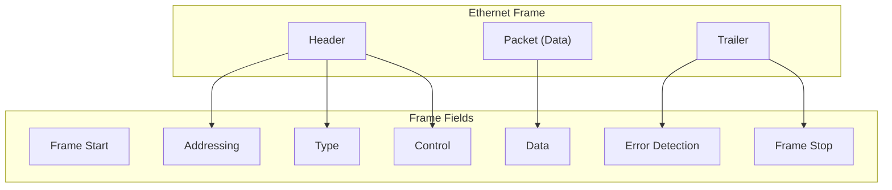

# **Datalink Layer**
## **1. Chức năng**
- Giao tiếp giữa các card mạng của end-device
- Cho phép những tầng bên trên truy cập vào tầng vật lý và đóng gói Layer3 Packet sang Layer2 Frame
- Phát hiện lỗi và bỏ qua những frame lỗi

## **2. Topology**
- Physical Topology
- Logical Topology
---
- WAN topology
    - P2P
    - Hub and Spoke: tất cả các thiết bị đều qua HUB
    - Mesh: Tất cả các thiết bị kết nối với nhau (full mesh/half mesh)
- LAN topology
    - Bus
    - Ring
    - Star (hiện nay phổ biến nhất)
---
### **Full duplex and Half duplex comunication**
- Half duplex: tại 1 thời điểm chỉ có 1 máy được gửi và nhận; máy khác phải chờ; có thể bị collision (Hub, repeater)
- Full duplex: các máy được truyền/nhận dữ liệu liên tục mà không cần phải chờ

---
### **CSMA**
- CSMA/CA --> Wifi
- CSMA/CD --> Ethernet: 
    - thiết bị sẽ gửi 1 gói tin để Request to send để kiểm tra xem có thiết bị nào đang gửi/nhận không?
    - nếu không thì switch gửi lại 1 gói tin Clear to send để xác nhận
    > Nếu cả 2 thiết bị nào đó đều gửi cùng 1 lúc thì switch sẽ quết định random thời điểm cho 2 máy

## **3. Data Frame**

**Cấu trúc**: gồm 3 phần
- Header
- Data
- Trailer: phát hiện lỗi

--- 
### **Fram Field**


- Frame Start and Frame Stop: Xác định Frame bắt đầu và kết thúc
- Addressing: Xác định địa chỉ MAC nguồn, MAC đích
- Type: Cho biết bộ giao thức tầng 3 sẽ sử dụng bộ giao thức nào (IPv4, IPv6, ICMP, OSPF, ...)
- Control
- Data
- Error Detection

---
### **Layer 2 Addresses**
MAC sublayer (Physical Address):
- Được chứa trong frame header
- Truyền phát nội bộ trong 1 link (Segment)

## **Ethernet Frame**
```text
                             Ethernet Frame (64–1518 bytes)

        8 bytes       6 bytes       6 bytes      2 bytes     46–1500 bytes    4 bytes
┌──────────────┬────────────────┬───────────────┬────────────┬────────────────┬─────────┐
│ Preamble +   │ Destination    │ Source MAC    │ Type /     │     Data       │   FCS   │
│     SFD      │ MAC Address    │   Address     │  Length    │   (Payload)    │         │
└──────────────┴────────────────┴───────────────┴────────────┴────────────────┴─────────┘
```

- Độ dài tối thiểu - tối đa: 64 bytes - 1518 bytes
- < 64: runt frame
- \> 1518: baby giant frame

--- 
### **MAC address**
- 48 bits = 12 kí tự Hex
- Là duy nhất trên toàn cầu
- Có thể bắt đầu bằng 0x
- 3 khối đầu sẽ cho biết nhà sản xuất

--- 

### **Frame Processing**
Nếu một thiết bị nhận được bản tin ARP request, nó so sánh địa chỉ MAC trên bản tin với MAC của chính nó: 
- Nếu trùng nó sẽ gửi lên L3 để có thể xử lý tiếp
- Nếu không nó sẽ hủy bỏ bản tin đó

- **Unicast MAC Address**
    - ARP: ánh xạ trực tiếp địa chỉ L2 và L3
    - Câu lệnh kiểm tra: arp -a
    - Switch lưu thông tin địa chỉ MAC ứng với từng cổng sử dụng bằng MAC Table (show mac address-table)

1:28

- **Multicast MAC Address**: forward cho một nhóm thiết bị 

## **MAC Address Table**
### **Switch Fundamentals**
- Là thiết bị chuyển mạch sử dụng bảng MAC 
- Cơ chế của Switch:
    - **Learning**: Kiếm tra địa chỉ MAcC nguồn, nếu chưa có thì đưa vào bảng MAC; nếu port đã tồn tại thì kiếm tra có thay đổi về port không; nếu có rồi thì refresh thời gian, nếu chưa có thì thêm 1 dòng mới
    -  **Forward**: kiêm tra xem MAC đích tồn tại hay chưa, nếu có rồi thì forward theo port; nếu chưa tồn tại thì forward cho tất cả các port (broadcast)

- Switch Speed and Forwarding Method
    - **Store and Forward**: tiếp nhận tất cả các frame rồi bắt đầu kiểm tra lỗi --> đảm bảo không có lỗi 
    - **Cut-through**: forward ngay khi nhận được frame đó mà chưa cần đủ 1 packet --> độ trễ thấp --> Chỉ check lỗi 64 bytes đầu tiên
    
- Memory buffering and switch
- Duplex and Speed Settings: **Auto Negotiation** (Tự động điều chỉnh giữa 2 đầu để có thể giảm va chạm)

- **Auto-MDIX** (*Medium Dependent Interface Crossover*): tự động điều chỉnh về vấn đề tiêu chuẩn bấm cáp giữa các thiết bị
 